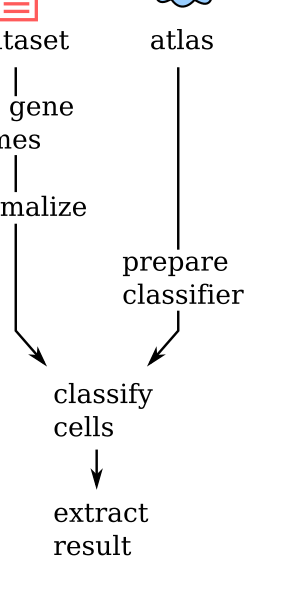

Tutorial
========
Thank you for looking into `northstar`! This tutorial guides you through a typical use of
the package to annotate your single cell dataset based on one or more cell atlases. At
the end of the tutorial, you can look at some :doc:`/examples` and at the detailed
:doc:`/api` documentation.

Flowchart
---------

Intro: atlas landmarks
--------------------------------
To transfer cell types from an atlas, you need a few cells or averages for each cell type
within the atlas. We call these **atlas landmarks**. To keep things simple, in this tutorial
we use precomputed landmarks from our `sister project <https://northstaratlas.github.io/atlas_landmarks/>`_.
Alternatively, you can use a custom atlas with its landmarks, see the :doc:`api` documentation of
classes :class:`.Averages` and :class:`.Subsample` for that advanced usage.

For this tutorial, we will use the atlas `Darmanis_2015 <https://www.pnas.org/content/112/23/7285>`_.

Prepare your single cell dataset
--------------------------------------
Then we need to prepare the new single cell dataset to annotate. For this tutorial, we will use the glioblastoma data from `Darmanis et al. (2017) <https://www.cell.com/cell-reports/fulltext/S2211-1247(17)31462-6?_returnURL=https%3A%2F%2Flinkinghub.elsevier.com%2Fretrieve%2Fpii%2FS2211124717314626%3Fshowall%3Dtrue>`_ which is made available for this tutorial as a `loom <http://loompy.org/>`_ file at `this address <https://cloudstor.aarnet.edu.au/plus/s/sOJgrj1Y8pj6pHB/download>`_.

.. code-block:: python
   import requests

   response = requests.get('https://cloudstor.aarnet.edu.au/plus/s/sOJgrj1Y8pj6pHB/download')
   with open('GBM_data.loom', 'wb') as f:
       f.write(response.content)

   del response

.. note::
   You can also download the file into the current folder using your browser, wget, curl, or whatever download manager. Just call the file `GBM_data.loom`.

.. code-block:: python

  dataset = anndata.read_loom('GBM_data.loom', sparse=False)

Let's make sure gene names are used as columns of the AnnData table:

.. code-block:: python

  dataset.var_names = dataset.var['GeneName']

.. note::
   `northstar` will take the intersection of your features names and the atlas features to
   assign cell types. Most atlases use gene names instead of EnsemblIDs or other names, so
   make sure you do the same. Remember human genes all ALL CAPS but mouse genes are
   Capitalized only.

We need to normalize the dataset:

- **log**: `northstar` will take the logarithm of the counts when necessary. If your data is already
  logged, undo the transformation (by exponentiating *and* subtracting any pseudocounts) before
  using northstar.

- **normalization**: `northstar` will look for overdispersed features in the new dataset prior to normalization.
  It is therefore highly recommended to normalize your new data (e.g. by counts per million reads
  or counts per 10,000 reads).

.. code-block:: python

  dataset.X = 1e6 * (dataset.X.T / dataset.X.sum(axis=1)).T

.. note::
   Forgetting to format the data according to the two rules above can lead to gross misclassification.

Choose an annotated atlas
-------------------------------
You can choose one of the available `atlas landmarks <https://northstaratlas.github.io/atlas_landmarks/>`_
by name, e.g. `Darmanis_2015` is an early atlas of the human brain, and `Darmanis_2015_nofetal` excludes fetal cells (our tutorial glioblastoma data are all adult tumors).

Optional: exploring atlas landmarks
+++++++++++++++++++++++++++++++++++++++++
`northstar` provides a class to explore our precompiled landmarks:

.. code-block:: python

   import northstar
   af = northstar.AtlasFetcher()

To list available atlases, just type:

.. code-block:: python

   af.list_atlases()

and to download one of them, for instance:

.. code-block:: python

   myatlas = af.fetch_atlas('Darmanis_2015_nofetal', kind='subsample')
   
.. note::
  If you just use the name (string) of a precompiled atlas landmark in the
  classifier (see below), the landmark will be automatically downloaded for you.

Alternative: custom atlas
+++++++++++++++++++++++++++++++++++++++++
You can also use a custom atlas. In that case, the atlas should be in an `AnnData` object (with rows as
cells, genes as columns):

- If you plan to use the `Subsample` class, the `AnnData` must have an `obs` column called
`CellType` that describes for each cell its cell type.
- If you plan to use the `Averages` class, the `AnnData` must have an `obs` column called `NumberOfCells` that is used to weight each cell type in the PCA. A value of 20 for all cell types is typical.

`northstar` provides a function to subsample an existing annotated dataset to small cell numbers within each cell type, ready for further use with the `Subsample` class. You data must be in an `AnnData` object. You can call it by:

.. code-block:: python

   import northstar
   myatlas = northstar.subsample_atlas(mydataset)

The default metadata column used for subsampling each cell type evenly is `CellType`. If your dataset uses a different column, you can just set the `cell_type_column` argument in this function.

Remember that the metadata column `CellType` is required anyway to use northstar. So you should set your cell type information into that column before or after subsampling:

.. code-block:: python

   myatlas.obs['CellType'] = myatlas.obs[my_other_column]

Prepare the classifier
-------------------------------
Let's assume you want to use the `.Subsample` class. You can create an instance of the class
as follows:

.. code-block:: python

  import northstar

  model = northstar.Subsample(
      atlas='Darmanis_2015',
      new_data=dataset,
      )

Classify your cells
------------------------
This is where the actual computations happen:

.. code-block:: python

  model.fit()

Advanced: understanding the single steps
+++++++++++++++++++++++++++++++++++++++++
If you are curious about the steps within `northstar`, you can call in your Jupyter notebook or ipython console:

.. code-block:: python

  model.fit??

and check out the steps one by one. Most users will not need this.

Extract the result
------------------
The result of the cell type assignment can be extracted by the following command:

.. code-block:: python

  cell_types = model.membership

This is a numpy array with the same length and order as your cells.

.. note::
   You can also run the classifier and exctract the result all at once using `model.fit_transform()`.

Downstream analysis
-----------------------
`northstar`'s main job is done with the cell type classification. Here some common downstream steps.

Optional: embbedding
+++++++++++++++++++++++++++++++++++++++++
Embeddings in two dimensions are useful to characterize single cell data. Northstar merges the atlas subsample/averages and the new dataset into the same PC space, and it's easy to get an embedding of your data "into" the atlas:

.. code-block:: python

  embedding = model.embed(method='umap')

Available embeddings are `tsne`, `umap`, and `pca`.

Optional: closest atlas cell type
+++++++++++++++++++++++++++++++++++++++++
Sometimes you get novel clusters that do not match any atlas cell type. To start identifying
those clusters, you can ask `northstar` what known atlas cell type they are most similar to.
Here's the code to do that:

.. code-block:: python

  closest_cell_types = model.estimate_closest_atlas_cell_type()

The output is a `pandas.Series` with the novel clusters as index and the closest atlas cell
types as values.

Optional: custom data harmonization
+++++++++++++++++++++++++++++++++++++++++
`northstar` divides the cell classification task in two steps:

1. Create a similarity graph that contains both the atlas and the new data
2. Cluster that graph with awareness of the atlas annotations.

For advanced users, it is possible to use a custom approach to step 1 and only use `northstar` for the atlas-aware clustering step 2. In this scenario, the similarity graph might be constructed using external data harmonization algorithms, such as scVI_, `BBKNN`_, Seurat3_, or whatever else.

.. _scVI: https://scvi.readthedocs.io/
.. _BBKNN: https://github.com/Teichlab/bbknn
.. _Seurat3: https://satijalab.org/seurat/

`northstar` offers the class `ClusterWithAnnotations` for this purpose:

.. code-block:: python

   import northstar
   model = northstar.ClusterWithAnnotations(graph, cell_types_atlas)
   cell_types_newcells = model.fit_transform()

where `graph` must be a `igraph.Graph` instance from `python-igraph <https://igraph.org/>`_ or a dense or sparse boolean square matrix representing the adjacency matrix of the graph (i.e. it has nonzeros on on `graph[i , j]` if cell `i` and cell `j` are neighbors).

Next steps
---------------------
Browse the :doc:`/examples` and :doc:`/api` pages for more information.

Conclusion
---------------------
We hope `northstar` helps you understand your tissue sample and do not hesitate to open an
`issue on github <https://github.com/iosonofabio/northstar/issues>`_ if you have trouble.
If `northstar` was useful for a publication, please consider citing us on `bioRxiv <https://www.biorxiv.org/content/10.1101/820928v2>`_.

.. toctree::
   :hidden:
   :maxdepth: 2
   :glob:

